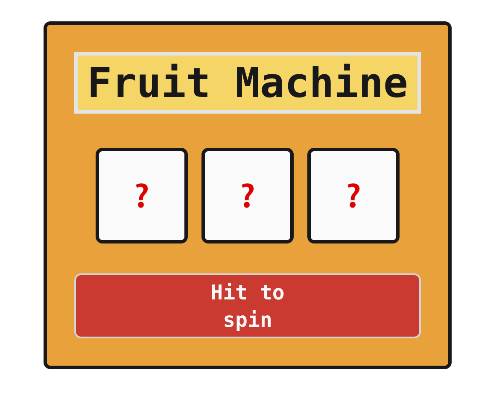
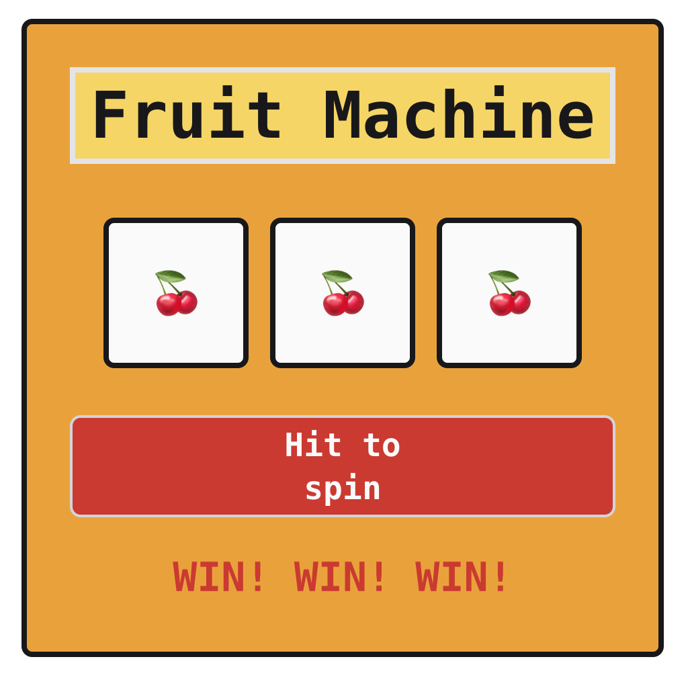

# Fruit Machine App

When first being introduced to React in week 8 of the Makers Software Development course, I had a little play building a very simple and fun Fruit Machine App.

I finished the course a week ago, to break up the monotony of CV writing and to practice my React, Cypress and CSS skills, I found a bit of time to finish this off.

## Installation/Usage Instructions

To download and initialise the project:

```js
$ git clone https://github.com/ChrisHutchinson1982/fruit-machine-react-
$ cd fruit-machine-react-
$ cd frontend
$ npm install
```

To run the app:

```js
$ cd fruit-machine-react-
$ cd frontend
$ npm run start
```

Open http://localhost:3000 to view and use the app in your browser.

To run the tests:

```js
$ cd fruit-machine-react-
$ cd frontend
$ npm run test
```

## Technologies

- React
- Node.js
- Cypress for testing
- CSS Tailwind for some very basic and fun styling

## Screenshots




